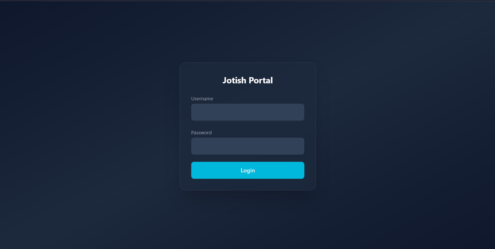
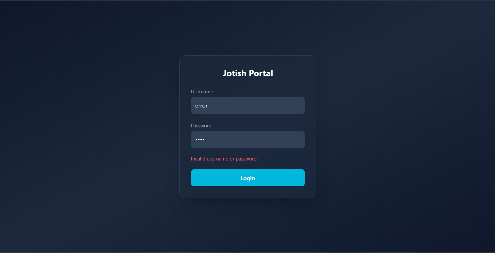
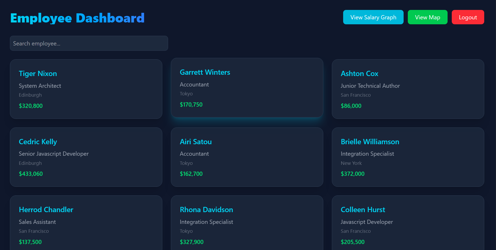
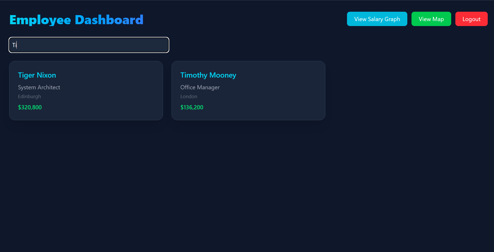
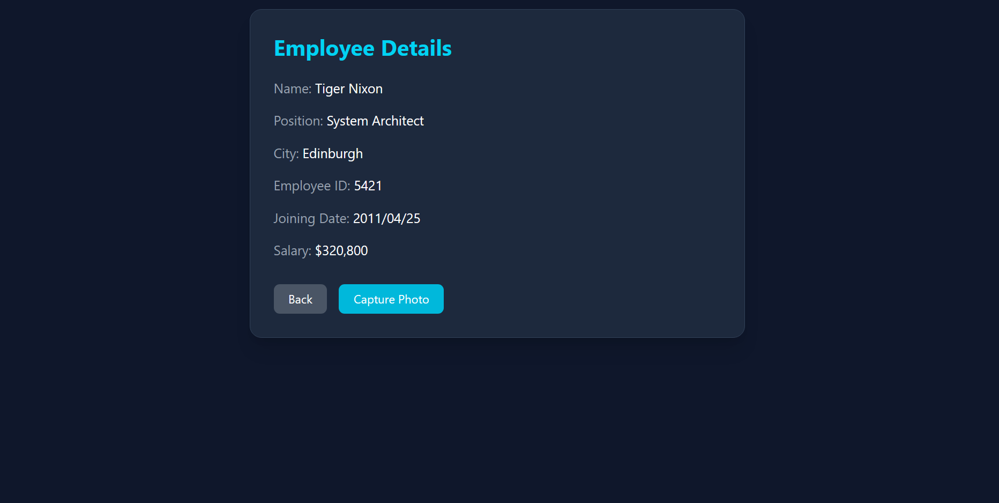
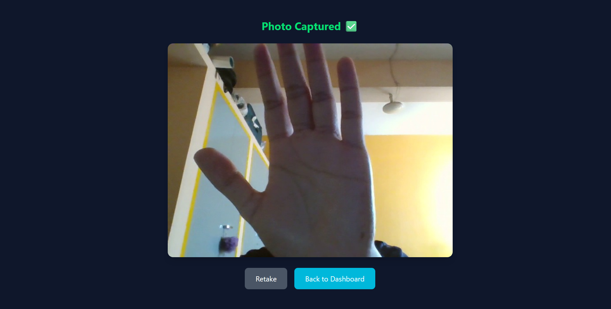
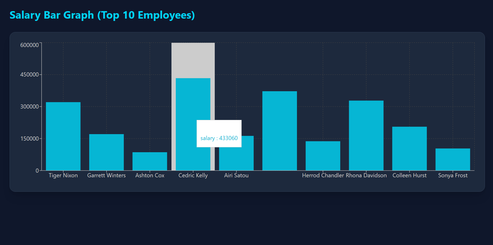
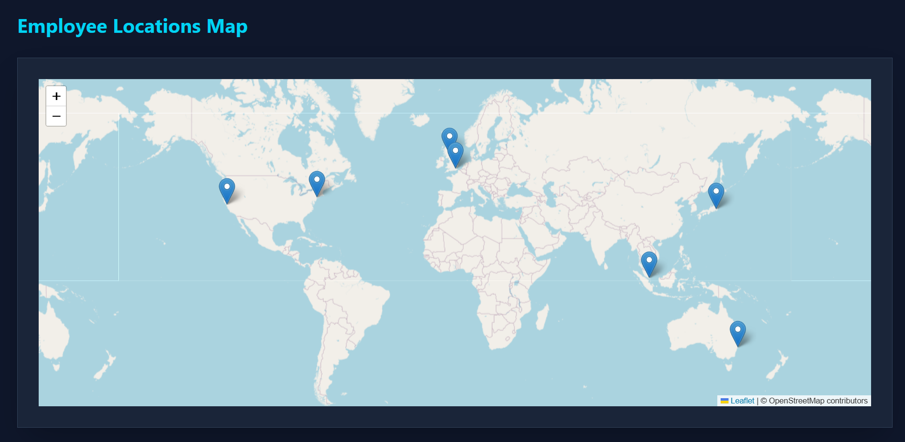
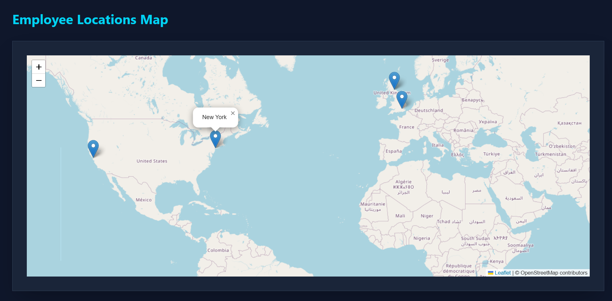

# 🚀 Jotish Internship Assignment

A ReactJS dashboard application developed as part of the Jotish Internship Assignment.

This project demonstrates authentication, REST API integration, data transformation, visualization, camera functionality, and responsive UI design using modern frontend best practices.

---

## 🎥 Demo Video

The following video demonstrates the complete working flow of the application, including login, dashboard, employee details, camera capture, bar graph visualization, and map integration.

👉 **Watch Demo Here:**  
https://www.loom.com/share/e73331c1bbfd418094fd7db314ad476d

---

## 🌟 Features

### 🔐 Authentication

- Login validation using environment variables
- Redirect to dashboard on successful authentication
- Logout functionality

### 📊 Employee Dashboard

- Fetches employee data from REST API
- Transforms raw API response into structured objects
- Responsive card layout
- Live search filtering
- Dashboard summary metrics:
  - Total Employees
  - Unique Cities
  - Highest Salary

### 📄 Employee Details Page

- Displays full employee information
- Clean and structured layout
- Navigation controls

### 📸 Camera Integration

- Capture employee photo using webcam
- Preview captured image
- Retake functionality

### 📈 Data Visualization

- Salary Bar Graph (Top 10 Employees)
- Interactive Map displaying employee cities

---

## 🛠 Tech Stack

- React (Vite)
- TailwindCSS
- React Router
- Axios
- Recharts
- React Leaflet
- React Webcam

---

## 🔌 API Integration

Data is fetched from:

```
https://backend.jotish.in/backend_dev/gettabledata.php
```

**POST Request Body:**

```json
{
  "username": "test",
  "password": "123456"
}
```

The API response is processed and transformed into structured objects before rendering within the UI.

---

## 🧠 Architecture Decisions

- API logic isolated in `services/api.js`
- Environment variables used for configuration
- Data transformation layer implemented for clean UI rendering
- Loading and error states handled gracefully
- Responsive layout using Tailwind utility classes
- Simple caching implemented to prevent redundant API calls

---

## ⚙️ Setup Instructions

### 1️⃣ Clone Repository

```bash
git clone https://github.com/thisisfaizanali/Jotish-Assignment
cd jotish-assignment
```

### 2️⃣ Install Dependencies

```bash
npm install
```

### 3️⃣ Create `.env` File

Create a `.env` file in the project root:

```
VITE_API_URL=https://backend.jotish.in/backend_dev/gettabledata.php
VITE_API_USERNAME=test
VITE_API_PASSWORD=123456
VITE_APP_USERNAME=testuser
VITE_APP_PASSWORD=Test123
```

### 4️⃣ Run Development Server

```bash
npm run dev
```

---

## 📂 Folder Structure

```
src/
 ├── pages/
 ├── services/
 ├── components/
 ├── App.jsx
 └── main.jsx
```

---

## 📸 Screenshots

### 🔐 Login Page

Normal Login View  


Invalid Credentials Error  


---

### 📊 Dashboard



Search Functionality  


---

### 📄 Employee Details



---

### 📸 Photo Capture & Preview



---

### 📈 Salary Bar Graph



---

### 🗺 Map View

Map Overview  


Map with City Popup  


---
